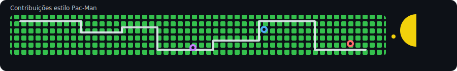

<h1 align="center">
  Olá, eu sou o Thales 
</h1>

---

 Cursando Técnico de Desenvolvimento de Sistemas no SENAI de Valinhos

 Interesses focados em **Front-end**, além de Segurança Cibernética e IoT

 Atualmente aprendendo mais sobre **JavaScript** e **React**

 Pergunte-me sobre **Front-end**

 Futuro desenvolvedor **Full Stack**

 📍 Valinhos, SP — Brasil

---

## Tecnologias que mais utilizo

  
  
  
  
  
  
  
  
  
  
  
  
  
  
  

 

---

## ✨ Minhas Estatísticas do GitHub

  
  

  

---

## 📅 Frase do dia

> "Quando temos vontade, nada está perdido."

  
Banco de frases (use uma por dia)

  - "Quando temos vontade, nada está perdido."
  - "Se pudesse redimir um erro terrível com sua própria vida... você não faria?"
  - "Às vezes, o destino nos dá uma segunda chance. Não a desperdice."
  - "Eu tenho um sonho: um dia cada pessoa controlará seu próprio destino."
  - "Nanomachines, filho!"
  - "Vamos queimar tudo. Das cinzas nascerá uma América evoluída."
  - "Lute pelo que você acredita, não por uma empresa."
  - "Palavras começam a revolução. A ação a termina."
  - "Aqueles que conhecem ódio também conhecem tristeza."
  - "Paz é só uma ilusão... mas vale a pena lutar por ela."
  - "Se você não lutar, você morre. Se não lutar, não pode vencer."
  - "Uma revolução sem dança não vale a pena."
  - "O povo não deve temer o governo. O governo deve temer o povo."
  - "Se você não arriscar, não criará um futuro!"
  - "Quem diz 'não pode ser feito' nunca deve interromper quem está fazendo."
  - "Aqueles que quebram as regras são lixo... mas aqueles que abandonam seus amigos são piores que lixo."
  - "Às vezes, o herói que a cidade precisa não é o que ela merece."
  - "Basta um dia ruim para reduzir o homem mais são à loucura."
  - "Se você é bom em alguma coisa, nunca faça de graça."

---

## 🟡 Contribuições estilo Pac-Man

  

---

## 📤 Se conecte comigo!

---

  

